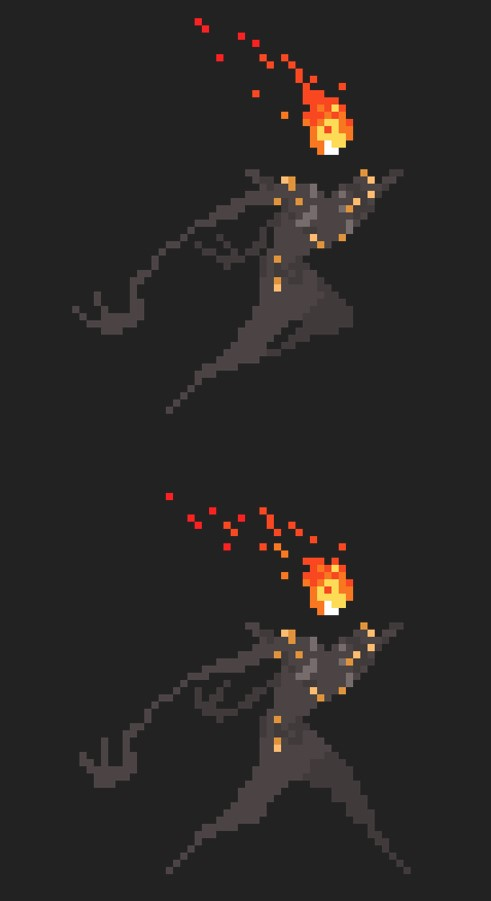

<!DOCTYPE html>

<html lang="en" xmlns="http://www.w3.org/1999/xhtml%22%3E
<head>
    <meta charset="utf-8" />
    <title>DGA1020  </title>
</head>
<body>

<h1>  Pixel Art</h1>
<h2>DGA1020:CW4</h2>

Pixel art is a form of digital art, drawn using software by exclusively placing pixel to build images.
It is widely associated with low resolution graphics. The precise definition of pixel art is a subject of debate 
digital artists, but usually an artwork is considered as pixel art if it seems like deliberate thought was put 
into each individual pixel of the image. Most works of pixel art are also restrictive in file size and the number
of colors used in their color palette, in order to achieve a certain retro/minimalistic aesthetic, or simply to 
reduce the perceived noise. The process of drawing pixel art characters or objects for video games is called spriting.
This term likely comes from the word sprite, which refers to a concept used in computer graphics related to bitmaps.

 
<a href="https://www.youtube.com/watch?v=2qVmwHnpaTE" target="_blank">History of Pixel Art</a>
  

</body>
</html>

